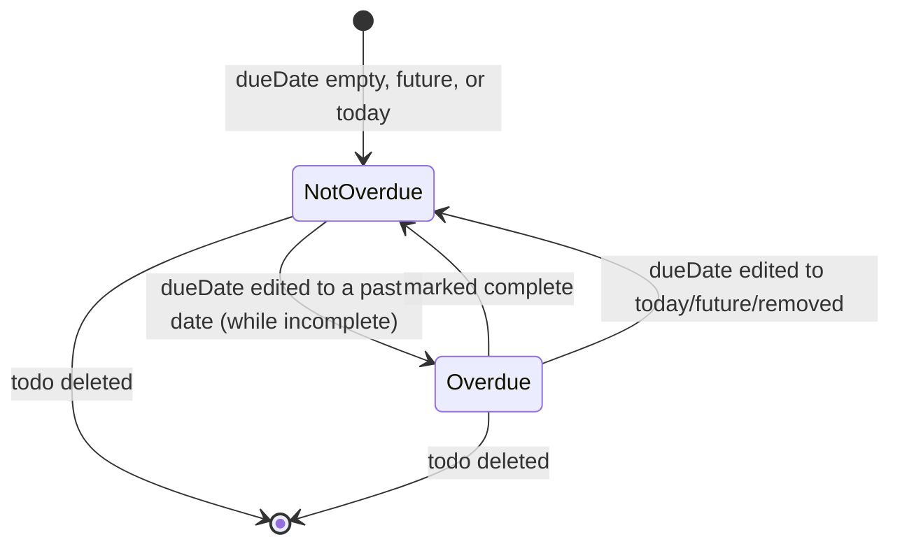

# Phase 1 Data Model: Overdue Todo Items

No schema or persisted-field changes. This feature adds a **derived (computed, non-persisted)**
concept on top of the existing `Todo Item` entity.

## Todo Item (existing, unchanged)

| Field | Type | Notes |
|---|---|---|
| `id` | number | Existing primary key |
| `title` | string | Existing, required, max 255 chars |
| `dueDate` | string (`YYYY-MM-DD`) or `null` | Existing, optional |
| `completed` | 0 \| 1 | Existing completion flag |
| `createdAt` | ISO datetime string | Existing, used for list ordering |

No new columns, migrations, or API fields are introduced.

## Derived Concept: Overdue Status (not persisted)

| Name | Type | Computed As |
|---|---|---|
| `isOverdue` | boolean | `completed === 0 && dueDate != null && dueDate < today` (date-only comparison, today from local device clock) |
| `overdueCount` | number | Count of todos in the current list where `isOverdue` is `true` |

### Rules (from spec Functional Requirements)

- FR-001–FR-004: `isOverdue` is `true` only for incomplete todos with a `dueDate` strictly
  before today; todos with no due date, due today, due in the future, or already completed
  are never overdue.
- FR-005–FR-006: `isOverdue` and `overdueCount` MUST reflect the latest `completed`/`dueDate`
  values immediately after any state change (toggle, edit) — satisfied automatically since
  both are recomputed from current component state on every render.
- FR-007: `overdueCount` is always rendered as a summary line above the list, including the
  zero case ("0 todos overdue").
- FR-008/FR-009: `isOverdue` drives both a color treatment and a text badge/label on the
  todo card; these are presentation concerns, not additional data fields.

## State Transitions

`isOverdue` is not stored, so there is no explicit state machine — it is a pure function of
existing `dueDate`/`completed` values evaluated at render time. Transitions naturally follow
from existing todo mutations:

